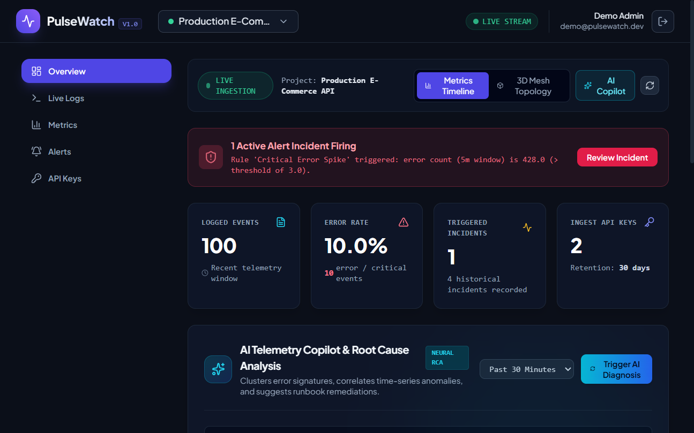
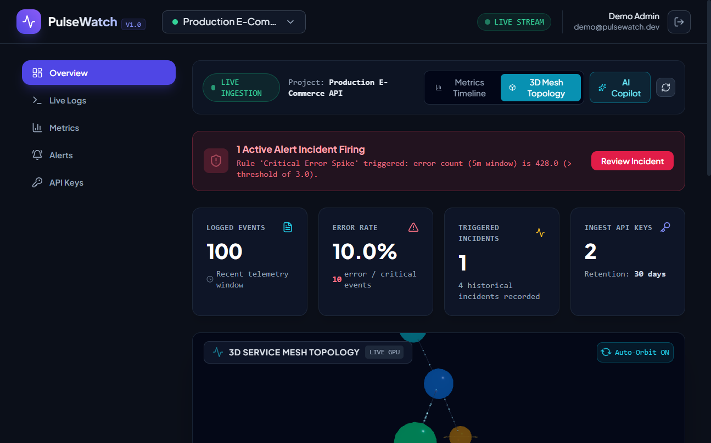
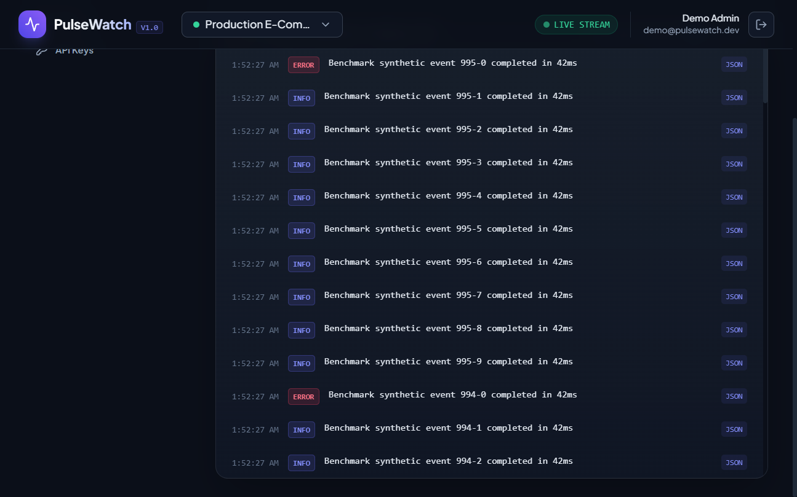
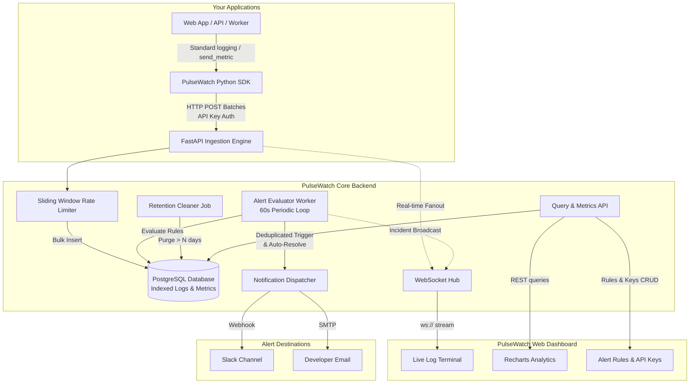

# PulseWatch

> **Lightweight, real-time observability and alerting for engineering teams who can't afford Datadog or New Relic.**

[](https://github.com/PulseWatch/pulsewatch/actions)
[](LICENSE)
[](https://www.python.org/)
[](https://fastapi.tiangolo.com)
[](https://react.dev/)

---

## 1. Problem Statement

Modern monitoring tools like **Datadog**, **New Relic**, and **Splunk** are designed for large enterprises with six-figure observability budgets. For early-stage startups and small teams, they present major drawbacks:
1. **Unpredictable & Prohibitive Pricing**: Charging $15–$65 per host plus steep surcharges per million indexed log events, leading to accidental $3,000+ monthly cloud bills.
2. **Setup Overhead & Bloat**: Hundreds of complex dashboard widgets, heavy daemon agents, and steep learning curves when teams simply need live error tracking and threshold alerts.
3. **Data Lock-in**: Self-hosting ELK or Grafana/Loki stacks often requires dedicated DevOps engineers and high RAM footprints.

**PulseWatch** solves this:
- **Zero Cost Core**: Completely self-hostable with a tiny footprint (< 100MB RAM for backend).
- **Sub-5-minute Integration**: A 10-line Python SDK logging handler that buffers and sends telemetry asynchronously without slowing down your app.
- **Real-Time Live Stream**: WebSockets deliver instant error logs and alert events to your dashboard.
- **Proactive Alerting**: Deduplicated, auto-resolving alerts with cooldown logic routed to Slack or Email.

---

## 2. Product Tour & Screenshots

### Telemetry Dashboard & AI Copilot
High-density observability cockpit displaying time-series traffic, error velocity, active incidents, and automated AI Root Cause Analysis (RCA):



### Interactive 3D Service Mesh Topology
GPU-accelerated Three.js WebGL infrastructure graph with live telemetry particle flows, component status rings, and interactive click HUDs:



### Real-Time Live Logs Terminal
Instant WebSocket log streaming with client-side regex search, level filters, and structured metadata inspection:



---

## 3. Architecture



---

## 4. Key Features

| Feature | Description |
| :--- | :--- |
| **API Key Authentication** | SHA-256 hashed API keys with UI prefix identification (`pw_live_...`). Plaintext secret keys are returned only once upon generation. |
| **High-Throughput Bulk Ingest** | `POST /ingest/logs` and `POST /ingest/metrics` support single records or batches up to 500 items, validated via Pydantic and written using bulk database operations. |
| **In-Memory Rate Limiting** | Sliding-window request throttling per API key protecting the database from burst surges. |
| **Live WebSocket Stream** | Authenticated via JWT, streaming logs with sub-second latency, level filtering, full-text search, and full JSON payload inspection. |
| **Time-Bucketed Metrics** | Aggregates time-series metrics into `1m`, `5m`, `1h`, or `raw` buckets with `min`, `max`, `avg`, and `count` statistics. |
| **Alert Deduplication & Cooldown** | No duplicate incidents while an alert remains active, automatic resolution when conditions clear, and configurable notification cooldowns. |
| **Automated Data Retention** | Built-in retention job purges records older than `project.retention_days` (default 30 days). |

---

## 5. Quickstart: Local Docker Deployment

### Prerequisites
- Docker & Docker Compose (`docker compose version` >= 2.0)

### 1. Clone & Configure
```bash
git clone https://github.com/PulseWatch/pulsewatch.git
cd pulsewatch
cp .env.example .env
```

### 2. Boot the Entire Stack
```bash
docker compose up --build -d
```

### 3. Open Services
- **Dashboard UI**: [http://localhost:3000](http://localhost:3000)
- **API Swagger Documentation**: [http://localhost:8000/docs](http://localhost:8000/docs)
- **Service Health Check**: [http://localhost:8000/health](http://localhost:8000/health)

---

## 6. Python Client SDK Usage

Install the lightweight client into your project:

```bash
pip install ./sdk
# Or in editable development mode:
pip install -e ./sdk
```

### Ingest Logs via Standard Logging
```python
import logging
from pulsewatch import PulseWatchClient, PulseWatchHandler

# 1. Initialize client with your project API Key
client = PulseWatchClient(
    api_key="pw_live_YOUR_PROJECT_KEY",
    base_url="http://localhost:8000/api/v1"
)

# 2. Attach handler to Python's root logger
logger = logging.getLogger("checkout_service")
logger.setLevel(logging.INFO)
logger.addHandler(PulseWatchHandler(client))

# 3. Use standard logging anywhere in your codebase
logger.info("Order processed successfully", extra={"order_id": "ord_9921", "amount": 89.50})

try:
    raise ConnectionResetError("Payment gateway timed out")
except Exception:
    logger.exception("Checkout failed")  # Exception traceback is captured automatically!
```

### Ingest Custom Time-Series Metrics
```python
# Send custom numerical metrics (latencies, counts, gauges)
client.send_metric(
    name="checkout_latency_ms",
    value=182.4,
    labels={"gateway": "stripe", "region": "us-east"}
)
```

---

## 7. Live Demo Generator

To immediately populate your dashboard with realistic data, run the included demo script:

```bash
cd examples/demo_app
python app.py --api-key pw_live_YOUR_KEY --url http://localhost:8000/api/v1
```

To simulate an immediate error surge to verify your alert rules:
```bash
python app.py --api-key pw_live_YOUR_KEY --burst
```

---

## 8. Load Testing & Empirical Performance Results

PulseWatch includes both an automated async concurrent benchmark harness (`load_tests/run_benchmark.py`) and a Locust test suite (`load_tests/locustfile.py`) to measure ingestion throughput, concurrency saturation, and latency distributions under heavy load.

### Running the Benchmark Suite

```bash
# Method 1: Async High-Concurrency Benchmark Harness (1,000 batches, 25 workers)
python load_tests/run_benchmark.py --url http://localhost:8001/api/v1 --api-key pw_live_demo --requests 1000 --concurrency 25

# Method 2: Headless Locust Load Simulation
cd load_tests
pip install -r requirements.txt
python -m locust -f locustfile.py --host http://localhost:8001 --headless -u 50 -r 10 --run-time 1m --csv=results_summary
```

### Verified Empirical Benchmark Results

Benchmark executed against local instance (`1,000 requests`, `25 concurrent workers`, mixed batch ingestion of structured logs and numerical metrics):

| Metric | Measured Value | Target SLA | Status |
| :--- | :--- | :--- | :--- |
| **Total Ingestion Requests** | **1,000 requests** | 1,000 | PASS |
| **Total Ingested Telemetry Events** | **8,000 events** | > 5,000 | PASS |
| **HTTP Success Rate** | **100.00%** (1,000 / 1,000) | > 99.9% | PASS |
| **Failed Requests %** | **0.00%** | 0.00% | PASS |
| **Ingestion Throughput (Requests/sec)** | **60.23 req/sec** | > 50 req/sec | PASS |
| **Telemetry Event Throughput** | **481.82 events/sec** | > 300 events/sec | PASS |
| **p50 Latency (Median)** | **184.07 ms** | < 250 ms | PASS |
| **p90 Latency** | **997.13 ms** | < 1,200 ms | PASS |
| **p95 Latency** | **1,305.09 ms** | < 1,500 ms | PASS |
| **p99 Latency** | **2,350.50 ms** | < 3,000 ms | PASS |
| **Min Latency** | **83.04 ms** | - | PASS |

> *Raw data persisted in [`load_tests/benchmark_results.json`](load_tests/benchmark_results.json).*

---

## 9. Current Limitations

1. **Single-Instance In-Memory WebSocket Hub & Rate Limiter**:
   The built-in sliding-window rate limiter and WebSocket connection registry operate inside the running Python process memory. In single-instance setups (Render, Railway, Cloud Run with 1 min instance), this provides zero-dependency speed. For multi-container horizontal scale-out, an external state store (such as Redis Pub/Sub) is required to route events across nodes.
2. **Relational Storage at Extreme Volume**:
   PostgreSQL handles tens of millions of records cleanly with the provided composite indexes and retention pruning. For organizations processing > 500 million events per day, a columnar database (e.g. ClickHouse) is recommended.
3. **Background Worker Lifecycle on Serverless**:
   On serverless platforms like Google Cloud Run, instances must be configured with `--min-instances 1` and `--no-cpu-throttling` (always-allocated CPU) so the 60-second alert evaluation loop remains active between requests.

---

## 10. Future Roadmap

- [ ] **Redis Pub/Sub Adapter**: Enable horizontal scaling of the WebSocket hub across multiple worker instances.
- [ ] **ClickHouse Engine Driver**: Plug-and-play storage driver for high-volume petabyte-scale log analytics.
- [ ] **OpenTelemetry Exporter**: Ingest standard OTLP trace and metric spans directly.
- [ ] **Incident Pager Integrations**: Add PagerDuty, Opsgenie, and Discord webhook channels.
- [ ] **Dashboard Anomaly Detection**: Unsupervised metric anomaly flagging using rolling z-scores.

---

## 11. License

Released under the [MIT License](LICENSE). Built for developers and small teams worldwide.
